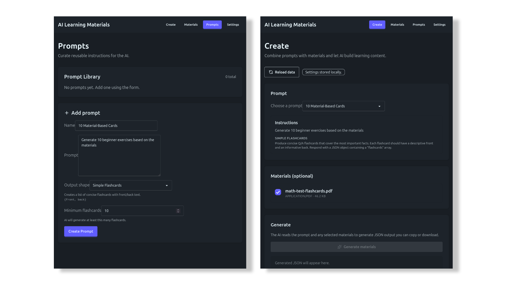

# AI-Based Learning Materials Generator

> [!WARNING]
> *Archival notice:* Not really worth it running this as a standalone app

Quick prototype to explore prompt & material management to generate learning content such as flashcards with LLMs.

## MVP Spec

- Settings page where user can provide their OpenAI API key
- Materials page where the user can upload documents (images, text files, ...) as well as do CRUD operations on them. 
- Prompt page where the user can manage their "prompts". For now, prompts (an entity) can have a name, the prompt content, and an output shape. The output shape should be JSON (using that OpenAI function where you can force the output shape). It is not actually editable by the user, the user only gets a dropdown with options. for now, just one option "Simple Flashcards". This forces the output shape to be {"front": string, "back": string}
- "Create" page (default) where the user can choose a prompt, choose material to attach, and let the AI generate material. Is shown as plaintext, and downloadable as JSON.